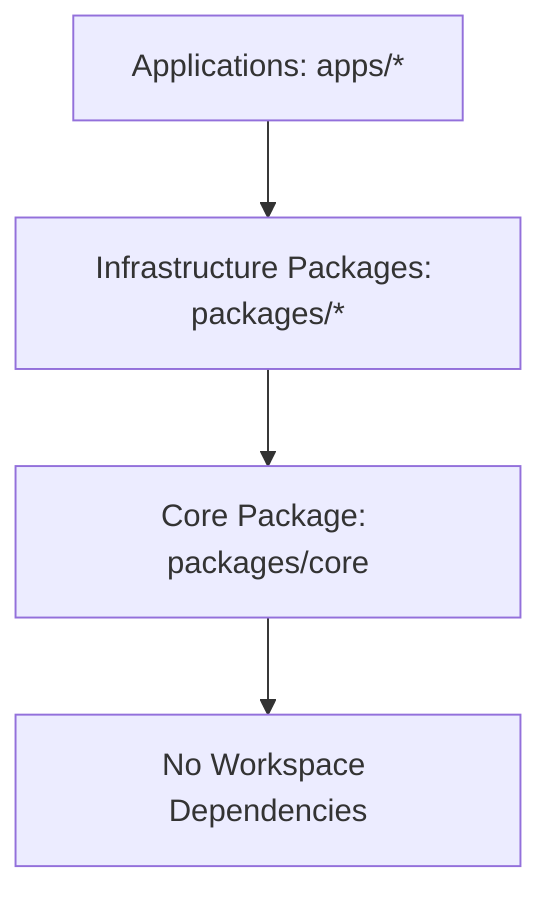

# ZentrixCRM Architecture Rules

This workspace follows strict design standards to ensure high maintainability, low latency, and smooth onboarding.

## 🏗️ Hybrid Modular Architecture (Vertical Slicing)

To keep features independently maintainable and easy to extract into separate microservices when they scale, all backend API code under `apps/api/src/modules/` must follow the **Self-Contained Hybrid Module Design**:

### 1. Self-Containment Rule
Every module must own its routes, controllers, services, repositories, validators, DTOs, and tests. Imports from other modules must be minimized and clearly documented.

### 2. Slicing Division Criteria: Flat vs. Nested

* **Small Modules (Flat Pattern):** 
  Default to a flat structure for new modules, or domains with fewer than 8–10 files. All domain files live at the root of the module folder.
  * *Example (auth):*
    ```
    modules/auth/
    ├── AuthRoutes.ts
    ├── RegisterRoutes.ts
    ├── PasswordResetRoutes.ts
    ├── OnboardingRoutes.ts
    └── index.ts
    ```

* **Large Modules (Nested Subdomains):**
  Promote a module to a nested structure once it outgrows 8–10 files, or starts containing distinct, complex business subdomains.
  * *Example (leads):*
    ```
    modules/leads/
    ├── lead/
    │   ├── LeadRoutes.ts
    │   ├── LeadController.ts
    │   └── LeadService.ts
    ├── enquiry/
    ├── site-visit/
    └── index.ts
    ```

### 3. Naming Conventions
* Routes: `*Routes.ts` (e.g. `AuthRoutes.ts`)
* Controllers: `*Controller.ts` (e.g. `LeadController.ts`)
* Services: `*Service.ts` or domain-specific names (e.g. `DistributionService.ts`)
* Database Access / Repositories: `*Repository.ts`
* Request Validation: `*Validator.ts`

---

## ⚡ Latency & Performance Rules
* **Heavy aggregations (Analytics / Leaderboard):** Must use the Redis caching middleware (`@zentrix/cache`) to prevent database pool exhaustion.
* **Voice Agent (Rohan):** All AI voice logic is isolated inside `apps/digital-employee` to run on a dedicated Node event loop, separating CPU-heavy streaming loads from CRUD API loads.

---

## 📡 API Versioning Guidelines
* **Version Namespace Mounting:** Route versioning must be handled at the Express router gateway level (e.g. `/api/v1` and `/api/v2`).
* **Feature Co-location:** When introducing breaking changes, create a versioned version of routes/controllers within the same subdomain folder (e.g. `LeadRoutesV2.ts` coexists inside `modules/leads/lead/`) to keep modules self-contained.
* **Fallback Resolution:** Unchanged sub-entities should reuse v1 controllers to minimize duplication, rather than copying entire module folders.

---

## ⚙️ Asynchronous Background Jobs
* **Dedicated Execution Daemon:** All intervals, loops, batch imports, email/SMS dispatches, and storage retention checkers must be offloaded to `apps/worker` to run in isolation.
* **Process Isolation:** The API server `apps/api` should not execute background schedulers or intervals.
* **Event-Triggered Tasks:** Routes needing async dispatches (such as welcoming a new lead or sending invoices) must publish an event to the Event Bus (`@zentrix/events`), leaving execution to the worker daemon.

---

## 🛑 Dependency Direction & Import Boundary Rules
To prevent architectural drift and maintain clean circular-dependency-free boundaries across applications and packages, the codebase follows a strict **Layered Dependency Hierarchy**:



### 1. Direction Rules
* **Apps to Packages Flow:** Applications (`apps/crm-web`, `apps/api`, `apps/digital-employee`, `apps/worker`) are permitted to import from shared workspace packages (`packages/*`).
* **Packages to Core Flow:** Workspace packages under `packages/*` are permitted to import from `@zentrix/core`.
* **Core to Nothing:** The `@zentrix/core` package represents the bottom-most layer and **MUST NEVER** import code or types from any other workspace packages or apps (it depends only on external Node libraries).

### 2. Boundary Constraints
* **No Packages to Apps Imports:** Packages under `packages/` must remain completely decoupled. They **MUST NEVER** import code or types from applications (`apps/*`).
* **UI/Client Isolation:** Client applications (`apps/crm-web`) must never import directly from database-level packages (`packages/database`) or worker files (`apps/worker`). Client interactions must flow exclusively via API requests (`packages/contracts`) or WebSockets.
* **Module Boundary Isolation:** Domain modules inside the API server should communicate via Event Bus topics (`@zentrix/events`) or explicitly exported service interfaces rather than directly accessing private implementation schemas of sibling modules.


---

## 🔑 Pinned Testing Credentials
Always use these credentials for local testing, browser simulations, and database logins:
* **Username/Email**: `admin@mayainfratech.in`
* **Password**: `Maya@2026`
