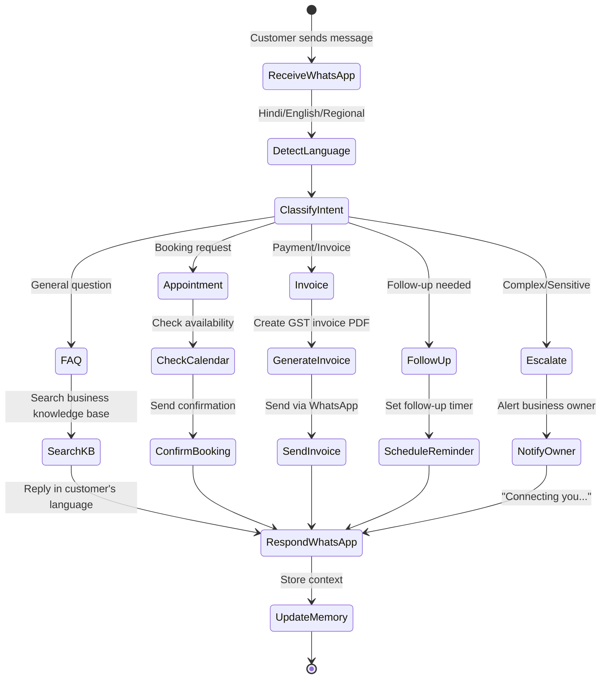
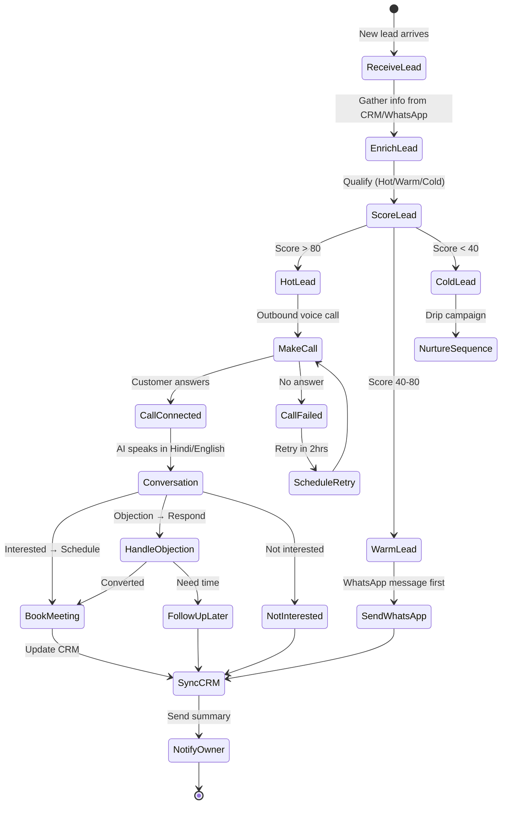
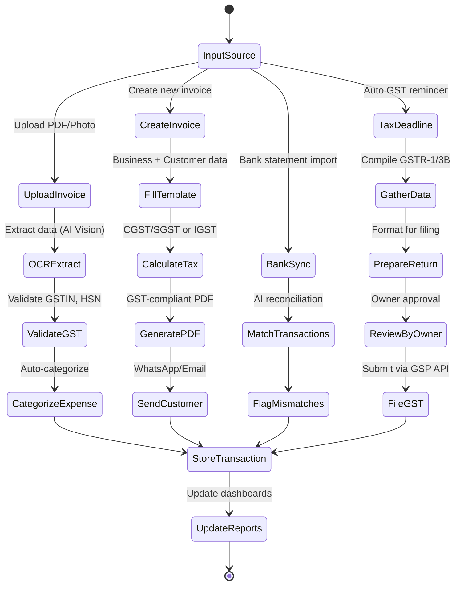
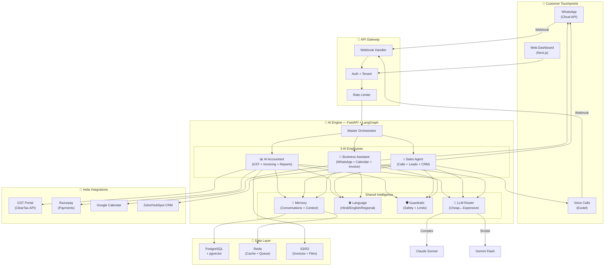
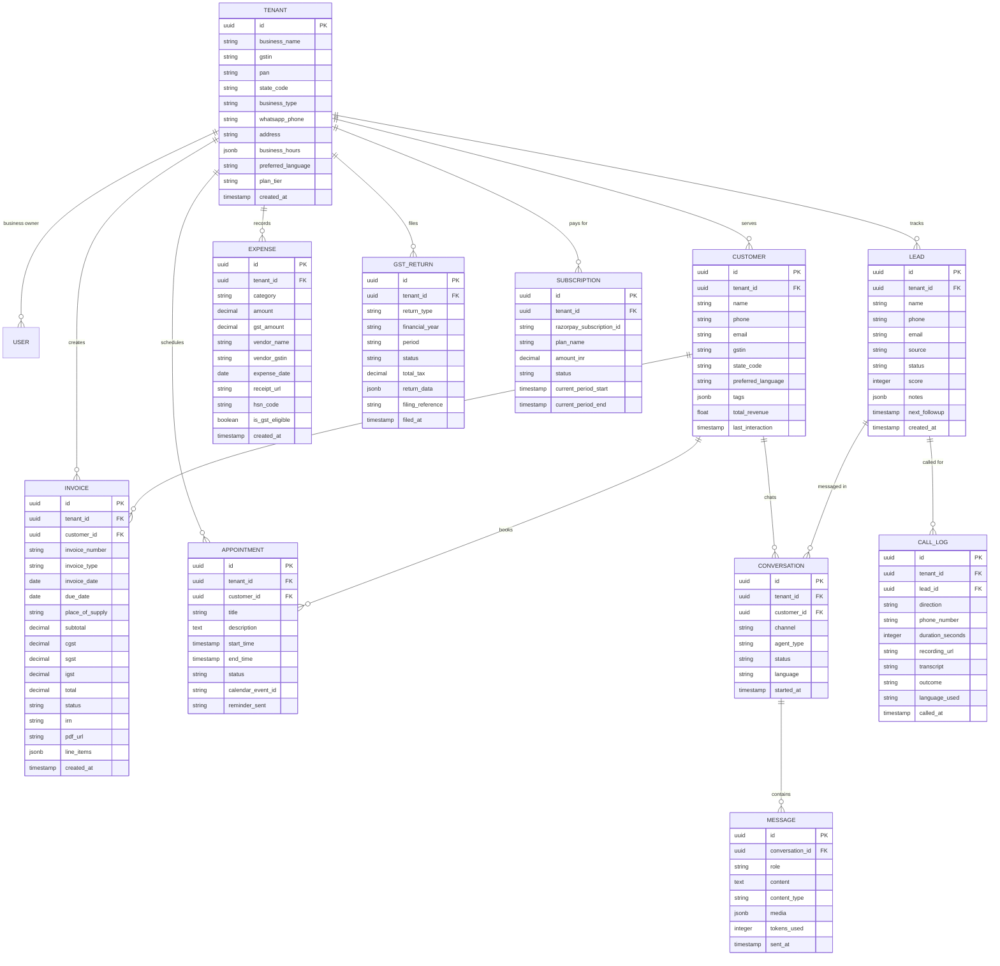

# 🇮🇳 Digital AI Employee — India-First SME Platform

> **Product Vision:** Build India's best AI Employee platform — a SaaS product where small businesses deploy AI workers that answer WhatsApp messages in Hindi, make sales calls, create GST invoices, follow up with customers, and handle accounting — all autonomously. Target market: **63M+ Indian SMEs**.

---

## User Review Required

> [!IMPORTANT]
> **Major Pivot:** Based on your refined requirements, I'm redesigning the architecture around **3 specialized AI employees** instead of a generic all-in-one agent. This is strategically better because:
> 1. Each agent has a focused, well-defined domain → higher quality
> 2. SMEs can start with one agent and add more → easier upselling
> 3. Clearer value proposition → easier marketing

> [!IMPORTANT]
> **Recommended Tech Stack (India-Optimized):**
>
> | Layer | Technology | Why? |
> |:---|:---|:---|
> | **Frontend** | Next.js 15 + TypeScript + shadcn/ui | Streaming AI responses, premium dashboard |
> | **AI Backend** | Python FastAPI + LangGraph | Best AI/ML ecosystem, production orchestration |
> | **Database** | PostgreSQL + pgvector | Structured data + vector search for memory |
> | **Cache/Queue** | Redis + Celery | Session state, background task processing |
> | **WhatsApp** | Meta WhatsApp Cloud API | Official API, no BSP middleman costs |
> | **Voice Calls** | Exotel (India) or Twilio | Best Indian telephony infra, <300ms latency |
> | **Payments** | Razorpay Subscriptions | Indian SaaS billing, UPI AutoPay support |
> | **GST/Invoicing** | ClearTax/MasterGST API + ReportLab | GST compliance + PDF invoice generation |
> | **Auth** | NextAuth.js + JWT | Multi-tenant authentication |
> | **Deployment** | Docker + Railway/AWS India (ap-south-1) | Low latency for Indian users |

> [!WARNING]
> **API Keys & Accounts Required Before Development:**
> - Meta Business Account (WhatsApp Cloud API)
> - Exotel or Twilio account (voice calling)
> - Razorpay account (payments)
> - Anthropic/OpenAI API key (LLM)
> - ClearTax or MasterGST API credentials (GST filing)
>
> **Do you have these, or should I build the system to work without them initially (using mocks)?**

---

## Open Questions

1. **Product Name:** "Digital AI Employee" is descriptive. Want a catchier Hindi/English brand name? (e.g., "KaamWala AI", "Sahayak AI", "BizBuddy")
2. **Voice Language Priority:** Which regional languages beyond Hindi/English first? (Tamil, Telugu, Marathi, Bengali, Gujarati?)
3. **CRM Choice:** Do Indian SMEs you're targeting already use a CRM? (HubSpot, Zoho, Salesforce, or should we build a simple built-in CRM?)
4. **WhatsApp Number:** Will each SME use their own WhatsApp Business number, or will they share yours?
5. **Pricing Tiers:** What price range are you thinking? (₹999/mo? ₹2,999/mo? ₹9,999/mo?)

---

## The 3 AI Employees

### 🤖 Agent 1: AI Business Assistant (WhatsApp-First)

**What it does for the SME:**
- Answers customer WhatsApp messages 24/7 in **Hindi, English, Hinglish**, and regional languages
- Books appointments and manages calendar
- Creates and sends GST-compliant invoices
- Follows up with customers automatically
- Sends payment reminders
- Handles FAQs about the business (hours, location, services, pricing)



---

### 📞 Agent 2: AI Sales Agent (Voice + WhatsApp)

**What it does for the SME:**
- Makes **outbound voice calls** in Hindi/English to leads
- Follows up on leads via WhatsApp messages
- Qualifies leads and scores them
- Schedules meetings/demos
- Syncs everything to CRM
- Sends post-call summaries to the business owner



---

### 📊 Agent 3: AI Accountant (GST + Invoicing)

**What it does for the SME:**
- Auto-generates **GST-compliant invoices** (with CGST/SGST/IGST)
- Processes incoming invoices (OCR + extraction)
- Categorizes expenses automatically
- Prepares **GSTR-1 and GSTR-3B** filing data
- Generates financial reports (P&L, balance sheet summaries)
- Sends tax deadline reminders
- Reconciles payments with bank statements



---

## System Architecture



---

## Proposed Changes — Detailed Folder Structure

### Backend (Python FastAPI + LangGraph)

#### [NEW] [backend/](file:///c:/Users/Sikandar%20Bharti/Desktop/DigitalAIEmployee/backend/)

```text
backend/
├── app/
│   ├── __init__.py
│   ├── main.py                              # FastAPI entry point
│   ├── config.py                            # Pydantic settings
│   ├── dependencies.py                      # DI containers
│   │
│   ├── api/
│   │   ├── __init__.py
│   │   ├── v1/
│   │   │   ├── __init__.py
│   │   │   ├── router.py                   # v1 API router
│   │   │   ├── endpoints/
│   │   │   │   ├── __init__.py
│   │   │   │   ├── chat.py                 # Chat/conversation endpoints
│   │   │   │   ├── whatsapp_webhook.py     # WhatsApp incoming webhook
│   │   │   │   ├── voice_webhook.py        # Exotel call webhooks
│   │   │   │   ├── agents.py              # Agent management
│   │   │   │   ├── invoices.py            # Invoice CRUD + PDF
│   │   │   │   ├── leads.py               # Lead management
│   │   │   │   ├── appointments.py        # Appointment booking
│   │   │   │   ├── gst.py                 # GST filing endpoints
│   │   │   │   ├── analytics.py           # Usage & metrics
│   │   │   │   ├── billing.py             # Razorpay subscription mgmt
│   │   │   │   └── onboarding.py          # Business setup wizard
│   │   │   └── schemas/
│   │   │       ├── __init__.py
│   │   │       ├── chat.py
│   │   │       ├── invoice.py             # Invoice Pydantic models
│   │   │       ├── lead.py
│   │   │       ├── gst.py                 # GST return schemas
│   │   │       └── common.py
│   │   └── middleware/
│   │       ├── __init__.py
│   │       ├── tenant.py                   # Multi-tenant context
│   │       ├── auth.py                     # JWT validation
│   │       ├── language.py                 # Language detection
│   │       └── rate_limit.py
│   │
│   ├── agents/                              # 🧠 LangGraph Agent Logic
│   │   ├── __init__.py
│   │   ├── orchestrator/
│   │   │   ├── __init__.py
│   │   │   ├── graph.py                    # Master routing graph
│   │   │   ├── state.py                    # Global state schema
│   │   │   └── router_node.py             # Intent → Agent routing
│   │   │
│   │   ├── business_assistant/             # 🤖 Agent 1
│   │   │   ├── __init__.py
│   │   │   ├── graph.py                    # WhatsApp assistant graph
│   │   │   ├── state.py
│   │   │   ├── nodes/
│   │   │   │   ├── __init__.py
│   │   │   │   ├── classify_intent.py     # What does customer want?
│   │   │   │   ├── answer_faq.py          # Knowledge base Q&A
│   │   │   │   ├── book_appointment.py    # Calendar booking
│   │   │   │   ├── create_invoice.py      # Invoice generation
│   │   │   │   ├── send_reminder.py       # Payment/follow-up reminders
│   │   │   │   └── escalate.py            # Notify business owner
│   │   │   └── prompts/
│   │   │       ├── system.py              # Hindi/English system prompts
│   │   │       └── templates.py           # Message templates
│   │   │
│   │   ├── sales_agent/                    # 📞 Agent 2
│   │   │   ├── __init__.py
│   │   │   ├── graph.py                    # Sales workflow graph
│   │   │   ├── state.py
│   │   │   ├── nodes/
│   │   │   │   ├── __init__.py
│   │   │   │   ├── score_lead.py          # Lead qualification AI
│   │   │   │   ├── make_call.py           # Exotel outbound call
│   │   │   │   ├── voice_conversation.py  # Real-time voice AI
│   │   │   │   ├── whatsapp_outreach.py   # WhatsApp follow-up
│   │   │   │   ├── schedule_meeting.py    # Book demo/meeting
│   │   │   │   ├── handle_objection.py    # Objection handling AI
│   │   │   │   └── sync_crm.py            # CRM update
│   │   │   └── prompts/
│   │   │       ├── call_scripts.py        # Hindi/English call scripts
│   │   │       └── whatsapp_templates.py
│   │   │
│   │   └── accountant/                     # 📊 Agent 3
│   │       ├── __init__.py
│   │       ├── graph.py                    # Accounting workflow graph
│   │       ├── state.py
│   │       ├── nodes/
│   │       │   ├── __init__.py
│   │       │   ├── create_invoice.py      # GST invoice generation
│   │       │   ├── process_invoice.py     # OCR + data extraction
│   │       │   ├── categorize_expense.py  # AI expense categorization
│   │       │   ├── calculate_gst.py       # CGST/SGST/IGST logic
│   │       │   ├── prepare_return.py      # GSTR-1/3B preparation
│   │       │   ├── reconcile.py           # Bank reconciliation
│   │       │   └── generate_report.py     # P&L, balance sheet
│   │       └── prompts/
│   │           └── accounting.py
│   │
│   ├── integrations/                        # 🔌 External Services
│   │   ├── __init__.py
│   │   ├── whatsapp/
│   │   │   ├── __init__.py
│   │   │   ├── client.py                   # WhatsApp Cloud API client
│   │   │   ├── webhook_handler.py          # Process incoming messages
│   │   │   ├── templates.py               # Message template manager
│   │   │   └── media.py                   # Image/PDF/Voice handling
│   │   ├── voice/
│   │   │   ├── __init__.py
│   │   │   ├── exotel_client.py           # Exotel API client
│   │   │   ├── call_manager.py            # Call lifecycle management
│   │   │   ├── tts.py                     # Text-to-Speech (Hindi)
│   │   │   └── stt.py                     # Speech-to-Text (Hindi)
│   │   ├── gst/
│   │   │   ├── __init__.py
│   │   │   ├── gsp_client.py             # GST Suvidha Provider API
│   │   │   ├── einvoice.py               # E-invoice (IRP) generation
│   │   │   ├── returns.py                # GSTR-1/3B filing
│   │   │   └── validators.py            # GSTIN, HSN validation
│   │   ├── payments/
│   │   │   ├── __init__.py
│   │   │   ├── razorpay_client.py        # Razorpay SDK wrapper
│   │   │   ├── subscription.py           # Plan management
│   │   │   └── webhook.py               # Payment webhooks
│   │   ├── calendar/
│   │   │   ├── __init__.py
│   │   │   └── google_calendar.py        # Google Calendar API
│   │   └── crm/
│   │       ├── __init__.py
│   │       ├── base.py                    # CRM interface
│   │       ├── zoho.py                    # Zoho CRM
│   │       └── hubspot.py                # HubSpot CRM
│   │
│   ├── invoicing/                           # 🧾 Invoice Engine
│   │   ├── __init__.py
│   │   ├── generator.py                    # Invoice data builder
│   │   ├── pdf_renderer.py                # ReportLab PDF creation
│   │   ├── templates/
│   │   │   ├── standard.py               # Standard GST invoice
│   │   │   ├── proforma.py               # Proforma invoice
│   │   │   └── credit_note.py            # Credit note template
│   │   ├── tax_calculator.py              # GST calculation engine
│   │   └── number_generator.py            # Sequential invoice numbering
│   │
│   ├── memory/                              # 🧠 Memory System
│   │   ├── __init__.py
│   │   ├── manager.py                      # Memory lifecycle
│   │   ├── short_term.py                   # Redis conversation context
│   │   ├── long_term.py                    # pgvector persistent memory
│   │   ├── customer_profile.py            # Customer preferences/history
│   │   └── business_knowledge.py          # Business FAQ/info store
│   │
│   ├── language/                            # 🌐 Multilingual Engine
│   │   ├── __init__.py
│   │   ├── detector.py                     # Auto-detect Hindi/English/Regional
│   │   ├── translator.py                  # Translation layer
│   │   ├── hindi_nlp.py                   # Hindi-specific NLP
│   │   └── templates/                     # Pre-built message templates
│   │       ├── hi.py                      # Hindi templates
│   │       ├── en.py                      # English templates
│   │       ├── mr.py                      # Marathi
│   │       ├── gu.py                      # Gujarati
│   │       ├── ta.py                      # Tamil
│   │       └── te.py                      # Telugu
│   │
│   ├── guardrails/                          # 🛡️ Safety Layer
│   │   ├── __init__.py
│   │   ├── input_validator.py
│   │   ├── output_filter.py               # PII masking (Aadhaar, PAN)
│   │   ├── budget_tracker.py              # Token cost limits per tenant
│   │   ├── call_limits.py                 # Voice call budget per tenant
│   │   └── human_approval.py             # Owner approval for big actions
│   │
│   ├── llm/                                 # 🤖 LLM Layer
│   │   ├── __init__.py
│   │   ├── router.py                       # Smart model routing
│   │   ├── providers/
│   │   │   ├── anthropic.py               # Claude (complex tasks)
│   │   │   ├── openai.py                  # GPT (fallback)
│   │   │   └── google.py                  # Gemini Flash (cheap tasks)
│   │   └── cost_tracker.py                # Per-tenant usage tracking
│   │
│   └── db/                                  # 💾 Database
│       ├── __init__.py
│       ├── models/
│       │   ├── __init__.py
│       │   ├── tenant.py                   # Business/Organization
│       │   ├── user.py                     # Business owner/staff
│       │   ├── customer.py                # End customers
│       │   ├── conversation.py            # Chat conversations
│       │   ├── message.py                 # Individual messages
│       │   ├── lead.py                    # Sales leads
│       │   ├── appointment.py             # Bookings
│       │   ├── invoice.py                 # Invoices (with GST)
│       │   ├── expense.py                 # Expenses
│       │   ├── transaction.py             # Financial transactions
│       │   ├── gst_return.py              # GST filing records
│       │   ├── call_log.py                # Voice call records
│       │   ├── memory.py                  # AI memory entries
│       │   ├── integration.py             # Connected services
│       │   └── subscription.py            # SaaS billing
│       ├── migrations/
│       ├── session.py                      # Async SQLAlchemy
│       └── seed.py                         # Demo data seeding
│
├── tests/
│   ├── unit/
│   │   ├── test_invoice_generator.py
│   │   ├── test_gst_calculator.py
│   │   ├── test_lead_scoring.py
│   │   └── test_language_detector.py
│   ├── integration/
│   │   ├── test_whatsapp_webhook.py
│   │   ├── test_exotel_call.py
│   │   └── test_razorpay_billing.py
│   └── e2e/
│       └── test_full_conversation.py
│
├── pyproject.toml
├── Dockerfile
├── docker-compose.yml                       # PG, Redis, app
├── .env.example
├── alembic.ini
└── langgraph.json
```

---

### Frontend (Next.js 15 — Premium SME Dashboard)

#### [NEW] [frontend/](file:///c:/Users/Sikandar%20Bharti/Desktop/DigitalAIEmployee/frontend/)

```text
frontend/
├── src/
│   ├── app/
│   │   ├── layout.tsx                       # Root layout (Outfit font, theme)
│   │   ├── page.tsx                         # 🌐 Landing page (Hindi + English)
│   │   ├── globals.css                      # Design system tokens
│   │   │
│   │   ├── (auth)/
│   │   │   ├── login/page.tsx              # Login (WhatsApp OTP option)
│   │   │   ├── signup/page.tsx             # Signup
│   │   │   └── layout.tsx
│   │   │
│   │   ├── (onboarding)/
│   │   │   ├── setup/page.tsx              # Business setup wizard
│   │   │   ├── whatsapp/page.tsx           # Connect WhatsApp
│   │   │   ├── knowledge/page.tsx          # Upload business info
│   │   │   └── layout.tsx
│   │   │
│   │   ├── (dashboard)/
│   │   │   ├── layout.tsx                   # Dashboard shell
│   │   │   ├── page.tsx                     # 📊 Overview (today's stats)
│   │   │   │
│   │   │   ├── conversations/
│   │   │   │   ├── page.tsx                 # 💬 All WhatsApp conversations
│   │   │   │   └── [id]/page.tsx           # Single conversation view
│   │   │   │
│   │   │   ├── sales/
│   │   │   │   ├── page.tsx                 # 📞 Lead pipeline view
│   │   │   │   ├── leads/page.tsx          # Lead management
│   │   │   │   ├── calls/page.tsx          # Call history + recordings
│   │   │   │   └── [leadId]/page.tsx       # Lead detail
│   │   │   │
│   │   │   ├── invoices/
│   │   │   │   ├── page.tsx                 # 🧾 Invoice list
│   │   │   │   ├── new/page.tsx            # Create invoice
│   │   │   │   └── [id]/page.tsx           # Invoice detail + PDF
│   │   │   │
│   │   │   ├── accounting/
│   │   │   │   ├── page.tsx                 # 📊 Financial overview
│   │   │   │   ├── expenses/page.tsx       # Expense tracking
│   │   │   │   ├── gst/page.tsx            # GST filing dashboard
│   │   │   │   └── reports/page.tsx        # P&L, Balance Sheet
│   │   │   │
│   │   │   ├── appointments/
│   │   │   │   └── page.tsx                 # 📅 Calendar view
│   │   │   │
│   │   │   ├── customers/
│   │   │   │   ├── page.tsx                 # 👥 Customer directory
│   │   │   │   └── [id]/page.tsx           # Customer profile + history
│   │   │   │
│   │   │   ├── agents/
│   │   │   │   ├── page.tsx                 # 🤖 AI Employee management
│   │   │   │   └── [id]/page.tsx           # Configure agent
│   │   │   │
│   │   │   ├── knowledge/
│   │   │   │   └── page.tsx                 # 📚 Train your AI (FAQ, docs)
│   │   │   │
│   │   │   └── settings/
│   │   │       ├── page.tsx                 # ⚙️ Business settings
│   │   │       ├── billing/page.tsx        # 💳 Subscription & billing
│   │   │       ├── integrations/page.tsx   # 🔗 Connect services
│   │   │       └── team/page.tsx           # 👤 Team members
│   │   │
│   │   └── api/
│   │       └── v1/
│   │           └── [...proxy]/route.ts     # Proxy to FastAPI
│   │
│   ├── components/
│   │   ├── ui/                              # shadcn/ui base components
│   │   ├── landing/
│   │   │   ├── Hero.tsx                    # Landing hero (Hindi tagline)
│   │   │   ├── Features.tsx               # 3 AI employees showcase
│   │   │   ├── Pricing.tsx                # Pricing cards (₹)
│   │   │   ├── Testimonials.tsx           # SME testimonials
│   │   │   └── CTASection.tsx             # WhatsApp signup CTA
│   │   ├── chat/
│   │   │   ├── WhatsAppView.tsx           # WhatsApp-style chat UI
│   │   │   ├── MessageBubble.tsx          # Green/white bubbles
│   │   │   ├── MessageInput.tsx           # Text + voice + file
│   │   │   └── ConversationList.tsx       # Conversation sidebar
│   │   ├── sales/
│   │   │   ├── LeadPipeline.tsx           # Kanban pipeline board
│   │   │   ├── LeadCard.tsx               # Lead display card
│   │   │   ├── CallPlayer.tsx             # Call recording player
│   │   │   └── LeadScoreBadge.tsx         # Hot/Warm/Cold badge
│   │   ├── invoicing/
│   │   │   ├── InvoiceForm.tsx            # Create invoice form
│   │   │   ├── InvoicePreview.tsx         # Live PDF preview
│   │   │   ├── GSTCalculator.tsx          # Tax breakdown display
│   │   │   └── InvoiceList.tsx            # Invoice table
│   │   ├── accounting/
│   │   │   ├── GSTDashboard.tsx           # GST filing status
│   │   │   ├── ExpenseChart.tsx           # Expense breakdown chart
│   │   │   ├── RevenueChart.tsx           # Revenue trend chart
│   │   │   └── FinancialSummary.tsx       # P&L summary card
│   │   ├── dashboard/
│   │   │   ├── Sidebar.tsx                # Nav sidebar (Hindi labels)
│   │   │   ├── Header.tsx                 # Top bar + notifications
│   │   │   ├── StatsGrid.tsx              # Today's key metrics
│   │   │   ├── ActivityFeed.tsx           # Real-time agent activity
│   │   │   └── QuickActions.tsx           # "Create Invoice", "Add Lead"
│   │   └── shared/
│   │       ├── Logo.tsx
│   │       ├── LanguageToggle.tsx         # Hindi/English switch
│   │       ├── CurrencyDisplay.tsx        # ₹ formatter
│   │       └── IndianPhoneInput.tsx       # +91 phone input
│   │
│   ├── lib/
│   │   ├── api.ts                          # API client
│   │   ├── websocket.ts                   # Real-time updates
│   │   ├── auth.ts                        # Auth helpers
│   │   ├── currency.ts                    # INR formatting
│   │   ├── date.ts                        # Indian date formats
│   │   └── utils.ts
│   │
│   ├── hooks/
│   │   ├── useConversations.ts
│   │   ├── useLeads.ts
│   │   ├── useInvoices.ts
│   │   ├── useGST.ts
│   │   └── useAnalytics.ts
│   │
│   ├── stores/
│   │   ├── conversationStore.ts
│   │   ├── leadStore.ts
│   │   ├── invoiceStore.ts
│   │   └── uiStore.ts
│   │
│   └── i18n/                               # 🌐 Internationalization
│       ├── en.json                         # English strings
│       ├── hi.json                         # Hindi strings
│       └── config.ts                       # i18n setup
│
├── public/
│   ├── icons/
│   └── images/
│
├── package.json
├── next.config.ts
├── tsconfig.json
└── .env.local.example
```

---

## Database Schema (India-Focused)



---

## Pricing Strategy (Suggested)

| Plan | Price | AI Employees | Limits |
|:---|:---|:---|:---|
| **Starter** | ₹999/mo | Business Assistant only | 500 WhatsApp messages, 50 invoices |
| **Growth** | ₹2,999/mo | Assistant + Sales Agent | 2,000 messages, 100 calls, 200 invoices |
| **Pro** | ₹4,999/mo | All 3 AI Employees | 5,000 messages, 300 calls, unlimited invoices, GST filing |
| **Enterprise** | ₹9,999/mo | All + Priority Support | Unlimited everything, dedicated support, custom integrations |

---

## Delivery Timeline

| Week | Milestone | Deliverables |
|:---|:---|:---|
| **Week 1** | 🏗️ Foundation | Project scaffolding, DB schema, auth, Docker setup, basic Next.js dashboard |
| **Week 2** | 💬 WhatsApp + Chat | WhatsApp Cloud API integration, webhook handling, chat UI, language detection |
| **Week 3** | 🤖 Business Assistant | FAQ answering, appointment booking, knowledge base, Hindi/English responses |
| **Week 4** | 🧾 Invoicing Engine | GST invoice generation, PDF rendering, WhatsApp delivery, expense tracking |
| **Week 5** | 📞 Sales Agent | Lead management, outbound calling (Exotel), lead scoring, CRM sync |
| **Week 6** | 📊 AI Accountant | Expense categorization, GSTR-1/3B prep, financial reports, bank reconciliation |
| **Week 7** | 🧠 Memory + Intelligence | Persistent memory, customer profiles, smart follow-ups, model routing |
| **Week 8** | 💰 Polish + Launch | Razorpay billing, onboarding wizard, landing page, production deployment |

---

## Verification Plan

### Automated Tests
```bash
# Backend
cd backend && pytest tests/ -v --cov=app --cov-report=html

# Frontend
cd frontend && npm run test && npx tsc --noEmit

# Type safety
cd backend && mypy app/
```

### Manual Verification
1. **WhatsApp Flow:** Send message → AI responds in correct language → verify invoice/appointment flow
2. **Voice Call:** Trigger outbound call → verify Hindi conversation quality → check CRM sync
3. **Invoice:** Create invoice → verify GST calculation (CGST/SGST vs IGST) → download PDF → verify compliance
4. **GST Filing:** Upload expenses → auto-categorize → prepare GSTR-1 → verify format matches GSTN schema
5. **Multi-tenant:** Two businesses → verify complete data isolation
6. **Billing:** Subscribe via Razorpay → verify plan limits enforced → test upgrade flow

---

## What Makes This The Best AI Employee for India

| Feature | Competitors | Our Platform |
|:---|:---|:---|
| **Language** | English-only or basic Hindi | Native Hindi, Hinglish, + 5 regional languages |
| **Channel** | Web chat / Email | **WhatsApp-first** (where India lives) |
| **Voice** | No voice calling | **Outbound AI calls in Hindi** |
| **Invoicing** | Generic invoices | **GST-compliant** (CGST/SGST/IGST, e-Invoice, IRN) |
| **Tax** | No tax support | **Automated GSTR-1/3B filing** |
| **Pricing** | $49-299/mo (too expensive) | **₹999-9,999/mo** (affordable for SMEs) |
| **Memory** | Stateless | Remembers every customer, every conversation |
| **Onboarding** | Complex setup | 5-minute WhatsApp-based setup |
