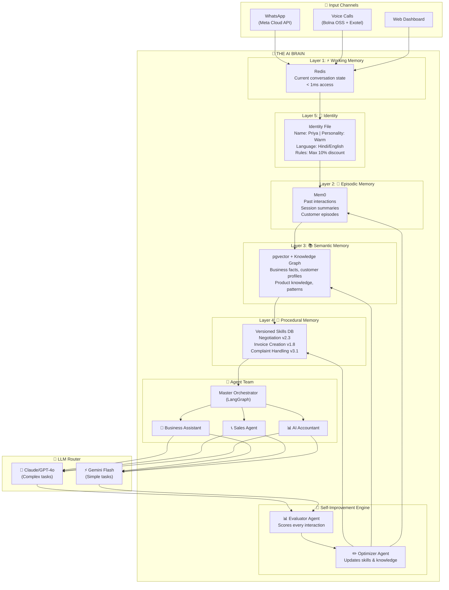
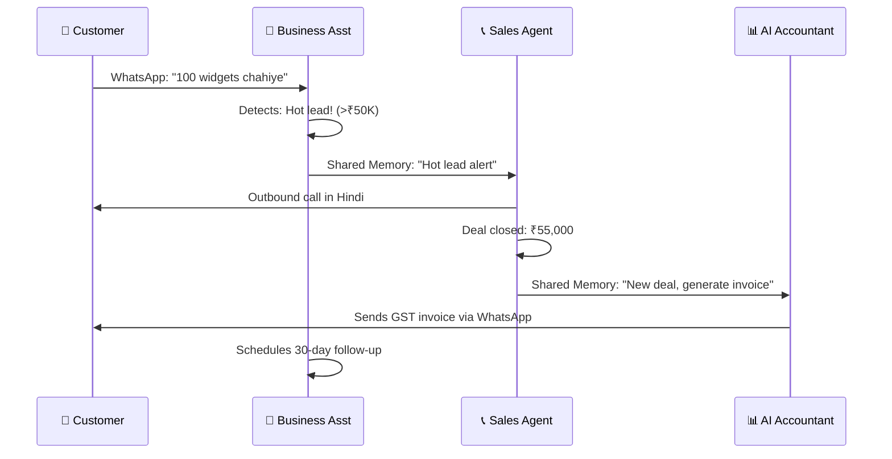
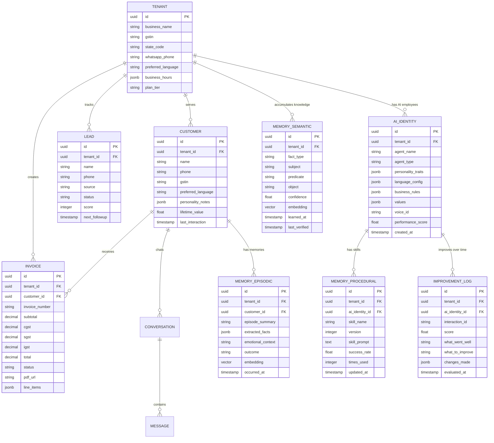

# 🧠 Digital AI Employee — World's First TRUE AI Employee Platform

> **Vision:** Build the world's first AI that doesn't just do tasks — it **becomes your employee**. It has a name, personality, persistent memory, learns your business, builds customer relationships, takes proactive initiative, and gets better every month. Target: **63M+ Indian SMEs**, starting at ₹999/mo.

---

## User Review Required

> [!IMPORTANT]
> **This is the FINAL plan incorporating ALL our research.** Once you approve, I start building immediately.
>
> Key decisions made based on our research:
> 1. **Bolna OSS** (open-source) for voice AI — 75% cheaper than SaaS
> 2. **Mem0** for persistent memory — the "brain" of our AI employee
> 3. **5-Layer Memory Architecture** — like a human brain
> 4. **Self-Improvement Engine** — AI that evaluates itself and gets better
> 5. **Identity System** — consistent personality across all conversations

> [!WARNING]
> **Before I start, confirm:**
> 1. Should I start with **mocks** for APIs (WhatsApp, Exotel, Razorpay) or do you have real API keys?
> 2. Product name: **"Digital AI Employee"** or something catchier? (Sahayak AI, KaamWala AI, BizBuddy?)
> 3. First priority: Should I build the **Backend Brain** first or the **Frontend Dashboard** first?

---

## What Makes This Unique (No One Else Has This)

| Our Breakthrough | How It Works | Competitor Status |
|:---|:---|:---|
| 🫀 **AI with a Soul** | Persistent identity — name, personality, voice, values | ❌ Nobody |
| ⚡ **Proactive Daily Routine** | Wakes up, sends reminders, follows up, gives morning reports | ❌ Nobody |
| 📈 **Self-Improving** | Evaluator-Optimizer loop — gets better every month | ❌ Nobody |
| 📱 **One-Number Business** | ONE WhatsApp number handles sales + support + invoicing | ❌ Nobody |
| 🤝 **AI Team Collaboration** | 3 agents share memory and coordinate automatically | ❌ Nobody |
| 🏢 **Digital Twin** | After 6 months, AI knows your entire business | ❌ Nobody |
| 🇮🇳 **Indian Culture Intelligence** | Understands "kal bhejta hoon", Diwali, udhar culture | ❌ Nobody |

---

## Tech Stack (Final — Research-Validated)

| Layer | Technology | Why This Choice |
|:---|:---|:---|
| **Frontend** | Next.js 15 + TypeScript + shadcn/ui | Premium dashboard, streaming AI responses |
| **AI Backend** | Python FastAPI + LangGraph | Best AI/ML ecosystem, stateful agent orchestration |
| **AI Memory** | **Mem0** (open-source) | Intelligent memory extraction, add/update/delete, vector+graph |
| **Voice Engine** | **Bolna OSS** (open-source, self-hosted) | Free Hindi voice AI, 75% cheaper than SaaS, Docker-ready |
| **Database** | PostgreSQL + **pgvector** | Structured data + vector search for semantic memory |
| **Cache** | Redis | Working memory (<1ms), session state, task queues |
| **WhatsApp** | Meta WhatsApp Cloud API | Official API, direct integration, no BSP markup |
| **Telephony** | Exotel (via Bolna OSS) | Indian phone numbers, <300ms latency |
| **STT** | Deepgram / Azure Speech | Best Hindi speech-to-text accuracy |
| **TTS** | ElevenLabs / Sarvam AI | Natural Hindi voice synthesis |
| **LLM (Complex)** | Claude Sonnet / GPT-4o | Complex reasoning, negotiation, accounting |
| **LLM (Simple)** | Gemini Flash | FAQ, routing, classification (cheap & fast) |
| **Payments** | Razorpay Subscriptions | UPI AutoPay, Indian SaaS billing |
| **GST/Invoicing** | ClearTax API + ReportLab | GST compliance + PDF generation |
| **Auth** | NextAuth.js + JWT | Multi-tenant authentication |
| **Deployment** | Docker + AWS India (ap-south-1) | Low latency for Indian users |

---

## The 5-Layer AI Brain Architecture



---

## The 3 AI Employees

### 🤖 Agent 1: AI Business Assistant (WhatsApp-First)
- Answers WhatsApp messages 24/7 in Hindi/English/Hinglish
- Books appointments and manages calendar
- Creates and sends GST-compliant invoices
- Follows up with customers proactively
- Sends payment reminders
- Handles FAQs, escalates complex queries

### 📞 Agent 2: AI Sales Agent (Voice + WhatsApp)
- Makes outbound voice calls in Hindi via Bolna OSS
- Follows up on leads via WhatsApp
- Qualifies and scores leads
- Schedules meetings/demos
- Handles objections using learned techniques
- Syncs everything to CRM

### 📊 Agent 3: AI Accountant (GST + Invoicing)
- Auto-generates GST-compliant invoices (CGST/SGST/IGST)
- Processes incoming invoices (OCR + extraction)
- Categorizes expenses automatically
- Prepares GSTR-1 and GSTR-3B filing data
- Generates financial reports
- Sends tax deadline reminders

### 🤝 How They Collaborate



---

## Proposed Changes — Complete Folder Structure

### Backend (Python FastAPI + LangGraph + Bolna OSS + Mem0)

#### [NEW] backend/

```text
backend/
├── app/
│   ├── __init__.py
│   ├── main.py                              # FastAPI entry point
│   ├── config.py                            # Pydantic settings
│   ├── dependencies.py                      # DI containers
│   │
│   ├── api/v1/
│   │   ├── router.py                        # v1 API router
│   │   ├── endpoints/
│   │   │   ├── chat.py                      # Chat/conversation endpoints
│   │   │   ├── whatsapp_webhook.py          # WhatsApp incoming webhook
│   │   │   ├── voice_webhook.py             # Bolna/Exotel call webhooks
│   │   │   ├── agents.py                    # Agent management
│   │   │   ├── invoices.py                  # Invoice CRUD + PDF
│   │   │   ├── leads.py                     # Lead management
│   │   │   ├── appointments.py              # Appointment booking
│   │   │   ├── gst.py                       # GST filing endpoints
│   │   │   ├── analytics.py                 # Usage & metrics
│   │   │   ├── billing.py                   # Razorpay subscription mgmt
│   │   │   ├── onboarding.py                # Business setup wizard
│   │   │   └── memory.py                    # Memory inspection/debug
│   │   ├── schemas/                         # Pydantic request/response models
│   │   └── middleware/
│   │       ├── tenant.py                    # Multi-tenant context
│   │       ├── auth.py                      # JWT validation
│   │       └── rate_limit.py
│   │
│   ├── brain/                               # 🧠 THE AI BRAIN (NEW)
│   │   ├── __init__.py
│   │   │
│   │   ├── identity/                        # 💖 Layer 5: Identity System
│   │   │   ├── __init__.py
│   │   │   ├── identity_manager.py          # Load/update identity files
│   │   │   ├── personality.py               # Personality trait definitions
│   │   │   ├── persona_check.py             # Drift detection agent
│   │   │   └── templates/
│   │   │       ├── business_assistant.yaml  # Priya's identity
│   │   │       ├── sales_agent.yaml         # Rahul's identity
│   │   │       └── accountant.yaml          # Meera's identity
│   │   │
│   │   ├── memory/                          # 🧠 Layers 1-3: Memory System
│   │   │   ├── __init__.py
│   │   │   ├── manager.py                   # Memory lifecycle orchestrator
│   │   │   ├── working.py                   # ⚡ Layer 1: Redis working memory
│   │   │   ├── episodic.py                  # 📖 Layer 2: Mem0 episodic memory
│   │   │   ├── semantic.py                  # 📚 Layer 3: pgvector semantic facts
│   │   │   ├── knowledge_graph.py           # Relationship tracking
│   │   │   ├── mem0_client.py               # Mem0 SDK integration
│   │   │   └── retriever.py                 # Multi-signal memory retrieval
│   │   │
│   │   ├── skills/                          # 🔧 Layer 4: Procedural Memory
│   │   │   ├── __init__.py
│   │   │   ├── skill_store.py               # Versioned skill management
│   │   │   ├── negotiation.py               # Negotiation skill (evolving)
│   │   │   ├── complaint_handling.py         # Complaint skill (evolving)
│   │   │   ├── invoice_creation.py          # Invoice skill
│   │   │   └── followup.py                  # Follow-up skill
│   │   │
│   │   ├── self_improvement/                # 🔄 Self-Improvement Engine (NEW)
│   │   │   ├── __init__.py
│   │   │   ├── evaluator.py                 # Scores every interaction
│   │   │   ├── optimizer.py                 # Updates skills & prompts
│   │   │   ├── feedback_loop.py             # Owner feedback processing
│   │   │   ├── performance_tracker.py       # Track metrics over time
│   │   │   └── skill_distiller.py           # Extracts new skills from successes
│   │   │
│   │   └── proactive/                       # ⚡ Proactive Engine (NEW)
│   │       ├── __init__.py
│   │       ├── scheduler.py                 # Daily routine scheduler
│   │       ├── morning_report.py            # Generate morning briefing
│   │       ├── auto_followup.py             # Auto follow-up on leads/invoices
│   │       ├── reminder_engine.py           # Payment/appointment reminders
│   │       └── pattern_detector.py          # Detect business patterns
│   │
│   ├── agents/                              # 🤖 LangGraph Agent Logic
│   │   ├── __init__.py
│   │   ├── orchestrator/
│   │   │   ├── graph.py                     # Master routing graph
│   │   │   ├── state.py                     # Global state schema
│   │   │   ├── router_node.py               # Intent → Agent routing
│   │   │   └── collaboration.py             # Inter-agent communication
│   │   │
│   │   ├── business_assistant/              # 🤖 Agent 1
│   │   │   ├── graph.py                     # WhatsApp assistant graph
│   │   │   ├── state.py
│   │   │   └── nodes/
│   │   │       ├── classify_intent.py       # What does customer want?
│   │   │       ├── answer_faq.py            # Knowledge base Q&A
│   │   │       ├── book_appointment.py      # Calendar booking
│   │   │       ├── create_invoice.py        # Invoice generation
│   │   │       ├── send_reminder.py         # Payment/follow-up reminders
│   │   │       └── escalate.py              # Notify business owner
│   │   │
│   │   ├── sales_agent/                     # 📞 Agent 2
│   │   │   ├── graph.py                     # Sales workflow graph
│   │   │   ├── state.py
│   │   │   └── nodes/
│   │   │       ├── score_lead.py            # Lead qualification AI
│   │   │       ├── make_call.py             # Bolna OSS outbound call
│   │   │       ├── voice_conversation.py    # Real-time voice AI
│   │   │       ├── whatsapp_outreach.py     # WhatsApp follow-up
│   │   │       ├── schedule_meeting.py      # Book demo/meeting
│   │   │       └── handle_objection.py      # Objection handling AI
│   │   │
│   │   └── accountant/                      # 📊 Agent 3
│   │       ├── graph.py                     # Accounting workflow graph
│   │       ├── state.py
│   │       └── nodes/
│   │           ├── create_invoice.py        # GST invoice generation
│   │           ├── process_invoice.py       # OCR + data extraction
│   │           ├── categorize_expense.py    # AI expense categorization
│   │           ├── calculate_gst.py         # CGST/SGST/IGST logic
│   │           ├── prepare_return.py        # GSTR-1/3B preparation
│   │           └── generate_report.py       # P&L, balance sheet
│   │
│   ├── integrations/                        # 🔌 External Services
│   │   ├── whatsapp/
│   │   │   ├── client.py                    # WhatsApp Cloud API client
│   │   │   ├── webhook_handler.py           # Process incoming messages
│   │   │   └── media.py                     # Image/PDF/Voice handling
│   │   ├── voice/
│   │   │   ├── bolna_engine.py              # Bolna OSS orchestration
│   │   │   ├── call_manager.py              # Call lifecycle management
│   │   │   └── stt_tts.py                   # Speech-to-Text/Text-to-Speech
│   │   ├── gst/
│   │   │   ├── gsp_client.py                # GST Suvidha Provider API
│   │   │   ├── einvoice.py                  # E-invoice generation
│   │   │   └── validators.py                # GSTIN, HSN validation
│   │   ├── payments/
│   │   │   ├── razorpay_client.py           # Razorpay SDK wrapper
│   │   │   └── subscription.py              # Plan management
│   │   └── calendar/
│   │       └── google_calendar.py           # Google Calendar API
│   │
│   ├── invoicing/                           # 🧾 Invoice Engine
│   │   ├── generator.py                     # Invoice data builder
│   │   ├── pdf_renderer.py                  # ReportLab PDF creation
│   │   ├── tax_calculator.py                # GST calculation engine
│   │   └── templates/
│   │       ├── standard.py                  # Standard GST invoice
│   │       └── proforma.py                  # Proforma invoice
│   │
│   ├── language/                            # 🌐 Multilingual Engine
│   │   ├── detector.py                      # Auto-detect Hindi/English
│   │   ├── hindi_nlp.py                     # Hindi-specific NLP
│   │   └── culture.py                       # Indian business culture rules
│   │
│   ├── guardrails/                          # 🛡️ Safety Layer
│   │   ├── input_validator.py
│   │   ├── output_filter.py                 # PII masking (Aadhaar, PAN)
│   │   ├── budget_tracker.py                # Token cost limits per tenant
│   │   └── human_approval.py                # Owner approval for big actions
│   │
│   ├── llm/                                 # 🤖 LLM Layer
│   │   ├── router.py                        # Smart model routing
│   │   ├── providers/
│   │   │   ├── anthropic.py                 # Claude (complex tasks)
│   │   │   ├── openai.py                    # GPT (fallback)
│   │   │   └── google.py                    # Gemini Flash (cheap tasks)
│   │   └── cost_tracker.py                  # Per-tenant usage tracking
│   │
│   └── db/                                  # 💾 Database
│       ├── models/
│       │   ├── tenant.py                    # Business/Organization
│       │   ├── user.py                      # Business owner/staff
│       │   ├── customer.py                  # End customers
│       │   ├── conversation.py              # Chat conversations
│       │   ├── message.py                   # Individual messages
│       │   ├── lead.py                      # Sales leads
│       │   ├── appointment.py               # Bookings
│       │   ├── invoice.py                   # Invoices (with GST)
│       │   ├── expense.py                   # Expenses
│       │   ├── gst_return.py                # GST filing records
│       │   ├── call_log.py                  # Voice call records
│       │   ├── memory_episodic.py           # 📖 Episodic memory entries
│       │   ├── memory_semantic.py           # 📚 Semantic fact entries
│       │   ├── memory_procedural.py         # 🔧 Skill versions
│       │   ├── identity.py                  # 💖 AI personality configs
│       │   ├── self_improvement_log.py      # 📈 Improvement tracking
│       │   └── subscription.py              # SaaS billing
│       ├── migrations/
│       ├── session.py                       # Async SQLAlchemy
│       └── seed.py                          # Demo data seeding
│
├── bolna/                                   # 🔊 Bolna OSS (Git Submodule)
│   └── (self-hosted voice AI engine)
│
├── tests/
├── pyproject.toml
├── Dockerfile
├── docker-compose.yml                       # PG, Redis, Mem0, Bolna, app
├── .env.example
└── alembic.ini
```

---

### Frontend (Next.js 15 — Premium SME Dashboard)

#### [NEW] frontend/

```text
frontend/
├── src/
│   ├── app/
│   │   ├── layout.tsx                       # Root layout (Outfit font)
│   │   ├── page.tsx                         # 🌐 Landing page
│   │   ├── globals.css                      # Design system
│   │   │
│   │   ├── (auth)/
│   │   │   ├── login/page.tsx               # Login (WhatsApp OTP)
│   │   │   └── signup/page.tsx              # Signup
│   │   │
│   │   ├── (onboarding)/
│   │   │   ├── setup/page.tsx               # Business setup wizard
│   │   │   ├── whatsapp/page.tsx            # Connect WhatsApp
│   │   │   ├── personality/page.tsx         # 💖 Customize AI personality
│   │   │   └── knowledge/page.tsx           # Upload business info
│   │   │
│   │   ├── (dashboard)/
│   │   │   ├── page.tsx                     # 📊 Overview + Morning Report
│   │   │   ├── conversations/page.tsx       # 💬 WhatsApp conversations
│   │   │   ├── sales/page.tsx               # 📞 Lead pipeline
│   │   │   ├── invoices/page.tsx            # 🧾 Invoice management
│   │   │   ├── accounting/page.tsx          # 📊 Financial overview
│   │   │   ├── appointments/page.tsx        # 📅 Calendar
│   │   │   ├── customers/page.tsx           # 👥 Customer directory
│   │   │   ├── ai-employees/page.tsx        # 🤖 AI Employee management
│   │   │   ├── ai-employees/[id]/page.tsx   # 💖 Configure personality
│   │   │   ├── memory/page.tsx              # 🧠 View what AI remembers
│   │   │   ├── performance/page.tsx         # 📈 AI improvement metrics
│   │   │   ├── knowledge/page.tsx           # 📚 Train your AI
│   │   │   └── settings/page.tsx            # ⚙️ Business settings
│   │   │
│   │   └── api/v1/[...proxy]/route.ts       # Proxy to FastAPI
│   │
│   ├── components/
│   │   ├── ui/                              # shadcn/ui base
│   │   ├── landing/                         # Landing page components
│   │   ├── chat/                            # WhatsApp-style chat UI
│   │   ├── sales/                           # Lead pipeline components
│   │   ├── invoicing/                       # Invoice components
│   │   ├── accounting/                      # Financial components
│   │   ├── ai-employee/                     # 🤖 AI personality editor
│   │   ├── memory/                          # 🧠 Memory browser
│   │   ├── performance/                     # 📈 Improvement charts
│   │   └── dashboard/                       # Dashboard components
│   │
│   ├── lib/
│   ├── hooks/
│   ├── stores/
│   └── i18n/                                # Hindi + English strings
│
├── package.json
└── next.config.ts
```

---

## Database Schema (With Memory Tables)



---

## Pricing Strategy

| Plan | Price | AI Employees | Limits |
|:---|:---|:---|:---|
| **Starter** | ₹999/mo | Business Assistant only | 500 WhatsApp msgs, 50 invoices |
| **Growth** | ₹2,999/mo | Assistant + Sales Agent | 2,000 msgs, 100 voice calls, 200 invoices |
| **Pro** | ₹4,999/mo | All 3 AI Employees | 5,000 msgs, 300 calls, unlimited invoices, GST filing |
| **Enterprise** | ₹9,999/mo | All + Priority Support | Unlimited everything, custom integrations |

---

## Delivery Timeline (10 Weeks)

| Week | Milestone | What Gets Built |
|:---|:---|:---|
| **Week 1-2** | 🏗️ Foundation + Brain | Project scaffolding, DB schema with memory tables, Docker setup (PG, Redis, Mem0), FastAPI skeleton, LangGraph setup, Identity system, basic Next.js dashboard |
| **Week 3** | 🧠 Memory System | Mem0 integration, 5-layer memory (working/episodic/semantic/procedural/identity), memory retrieval pipeline, customer profile builder |
| **Week 4** | 💬 WhatsApp + Business Assistant | WhatsApp Cloud API, webhook handler, intent classification, FAQ answering, appointment booking, Hindi/English/Hinglish, personality-consistent responses |
| **Week 5** | 🧾 Invoicing + Accountant | GST invoice generation, PDF rendering, CGST/SGST/IGST calculation, expense categorization, GSTR-1/3B preparation |
| **Week 6** | 📞 Voice + Sales Agent | Bolna OSS setup (self-hosted), Hindi voice calls via Exotel, lead scoring, outbound calling, objection handling, call recording + transcript |
| **Week 7** | 🤝 Agent Collaboration | Inter-agent communication (shared memory bus), auto-handoff (lead → sales → accountant), one-number routing, orchestrator upgrades |
| **Week 8** | 🔄 Self-Improvement Engine | Evaluator agent, Optimizer agent, performance tracking, skill versioning, feedback loop from business owner, monthly performance reports |
| **Week 9** | ⚡ Proactive Engine | Daily routine scheduler, morning reports, auto follow-ups, payment reminders, pattern detection, Diwali/festival awareness |
| **Week 10** | 💰 Polish + Launch | Razorpay billing, onboarding wizard, personality customization UI, memory browser UI, landing page, production deployment |

---

## Verification Plan

### Automated Tests
```bash
# Backend
cd backend && pytest tests/ -v --cov=app --cov-report=html

# Frontend
cd frontend && npm run test && npx tsc --noEmit

# Memory system
cd backend && pytest tests/unit/test_memory_system.py -v

# Self-improvement
cd backend && pytest tests/unit/test_evaluator.py -v
```

### Manual Verification
1. **Memory Test:** Chat with AI → close chat → chat again → verify it REMEMBERS the customer
2. **Personality Test:** 50 conversations → verify tone/language stays consistent with identity file
3. **Learning Test:** Deliberately fail a negotiation → verify AI tries different approach next time
4. **Collaboration Test:** Send WhatsApp lead → verify Sales Agent calls → verify Accountant invoices
5. **Proactive Test:** Set up overdue invoice → verify AI sends reminder WITHOUT being asked
6. **Hindi Test:** Full conversation in Hindi → verify natural Hinglish responses
7. **GST Test:** Create invoice → verify CGST/SGST vs IGST based on state codes
8. **Voice Test:** Outbound Hindi call via Bolna → verify conversation quality

---

## Cost Analysis (Per-Tenant Monthly)

| Component | ₹999 Plan | ₹2,999 Plan | ₹4,999 Plan |
|:---|:---|:---|:---|
| LLM (Gemini Flash 80% / Claude 20%) | ~₹150 | ~₹400 | ~₹800 |
| Mem0 (self-hosted) | ₹0 | ₹0 | ₹0 |
| Bolna OSS (self-hosted) | ₹0 | ₹0 | ₹0 |
| STT + TTS (per call) | ₹0 | ~₹200 | ~₹500 |
| Exotel telephony | ₹0 | ~₹300 | ~₹700 |
| WhatsApp (Meta fees) | ~₹100 | ~₹250 | ~₹500 |
| Infrastructure (per tenant share) | ~₹50 | ~₹100 | ~₹200 |
| **Total Cost** | **~₹300** | **~₹1,250** | **~₹2,700** |
| **Revenue** | **₹999** | **₹2,999** | **₹4,999** |
| **Gross Margin** | **70%** | **58%** | **46%** |

> [!TIP]
> Self-hosting Bolna OSS and Mem0 saves us **₹40,000+/month** at scale vs using SaaS alternatives. This is how we can price at ₹999/mo and still be profitable.
