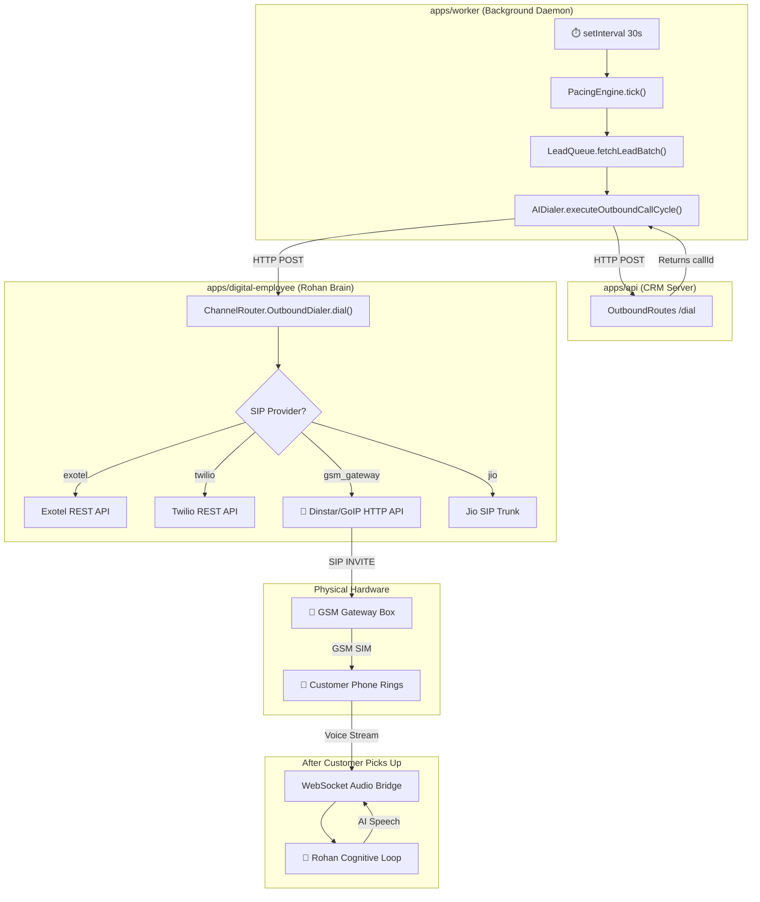
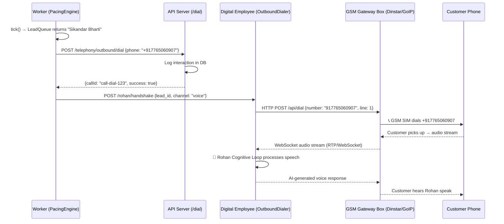

# How Rohan AI Calls Leads via CRM Dialer & GSM Gateway

## The Big Picture

Rohan runs as a **background daemon** inside `apps/worker`. Every **30 seconds**, a timer fires and Rohan autonomously decides which leads to call — no human clicks a button. The call then travels through 4 systems before a real phone rings.



---

## Step-by-Step Call Chain

### Step 1 → PacingEngine (The Clock)

**File:** [PacingEngine.ts](file:///c:/Users/Sikandar%20Bharti/Desktop/ZentrixCRM/apps/worker/src/dialer/PacingEngine.ts)  
**Runs in:** `apps/worker` (background Node.js process)  
**Trigger:** `setInterval(30000)` — fires every 30 seconds automatically

Every tick:
1. Queries `ai_employee_personas` → is Rohan `idle` or `busy` or `offline`?
2. Checks `max_concurrent_calls` (default: 10 SIM lines)
3. Checks daily limits via `CampaignManager`
4. If lines are available → calls `LeadQueue.fetchLeadBatch()` to get pending leads

```typescript
// apps/worker/src/index.ts line 140-143
const pacingEngine = new PacingEngine();
setInterval(async () => {
    await pacingEngine.tick();
}, 30000);
```

> [!IMPORTANT]
> This is fully autonomous. No manager needs to click anything. Rohan wakes up every 30 seconds, checks if he's on shift, checks if he has spare lines, and dials.

---

### Step 2 → LeadQueue (Who to Call)

**File:** [LeadQueue.ts](file:///c:/Users/Sikandar%20Bharti/Desktop/ZentrixCRM/apps/worker/src/dialer/LeadQueue.ts)

SQL query selects leads where:
- `assigned_to = Rohan's user ID` (the `[Assign to Rohan]` button sets this)
- `status` is dialable (`new`, `nurture`, `contacted`, `qualified`, etc.)
- **Not already called today** (prevents hammering)
- Ordered by `priority DESC` (High → Medium → Low)

```sql
SELECT l.id, l.name, l.phone, l.tenant_id
FROM leads l
LEFT JOIN interactions i ON i.lead_id = l.id AND i.type = 'Call' AND i.date >= CURRENT_DATE
WHERE l.assigned_to = $1          -- Rohan's user ID
  AND l.tenant_id = $2
  AND l.status IN ('new', 'nurture', 'contacted', 'qualified', ...)
  AND i.id IS NULL                -- NOT called today
ORDER BY priority DESC
LIMIT $3                          -- max available phone lines
```

---

### Step 3 → AIDialer (The Call Lifecycle)

**File:** [AIDialer.ts](file:///c:/Users/Sikandar%20Bharti/Desktop/ZentrixCRM/apps/worker/src/dialer/AIDialer.ts)

For each lead returned by `LeadQueue`, the `AIDialer` runs a 5-step lifecycle:

| Step | What Happens | HTTP Target |
|------|-------------|-------------|
| **1. Select Lead** | Logs which prospect was chosen | — |
| **2. Place Call** | `POST /api/v1/telephony/outbound/dial` | → `apps/api` OutboundRoutes |
| **3. Voice Stream** | Opens WebSocket audio bridge | → `apps/digital-employee` |
| **4. Attach Rohan** | `POST /rohan/handshake` — connects AI brain | → `apps/digital-employee` |
| **5. Track Outcome** | Logs to `interactions`, updates `leads.status` | → PostgreSQL directly |

```typescript
// Step 2: The actual HTTP call that triggers the phone to ring
const response = await axios.post(
    `${this.crmApiUrl}/api/v1/telephony/outbound/dial`,
    { leadId: session.leadId, phone: session.phone, tenantId: session.tenantId }
);
```

---

### Step 4 → OutboundRoutes (CRM API Gateway)

**File:** [OutboundRoutes.ts](file:///c:/Users/Sikandar%20Bharti/Desktop/ZentrixCRM/apps/api/src/modules/telephony/outbound/OutboundRoutes.ts)

This is the **same endpoint** that the CRM web UI dialer uses when a human sales rep clicks "Call" on a lead card. Rohan uses the exact same route.

```
POST /api/v1/telephony/outbound/dial
Body: { leadId, phone, tenantId }
Response: { success: true, callId: "call-dial-1752..." }
```

> [!NOTE]
> Currently this endpoint returns a mock `callId`. To make **real** calls, this route needs to forward the dial request to the actual telephony provider (Exotel, Twilio, or GSM Gateway). The integration point is in `ChannelRouter.ts`.

---

### Step 5 → ChannelRouter.OutboundDialer (The GSM Bridge)

**File:** [ChannelRouter.ts](file:///c:/Users/Sikandar%20Bharti/Desktop/ZentrixCRM/apps/digital-employee/src/channels/ChannelRouter.ts#L179-L356)

This is where the **actual telephony provider** is selected and the real phone call is placed.

```typescript
export type SIPProvider = 'exotel' | 'twilio' | 'jio' | 'gsm_gateway';
```

The provider is configured **per-tenant** in the `tenants.settings` JSON column:

```json
{
  "sip_config": {
    "provider": "gsm_gateway",
    "api_key": "your-gateway-api-key",
    "api_secret": "your-gateway-secret",
    "from_number": "+91XXXXXXXXXX"
  }
}
```

The `initiateSIPCall()` method switches on the provider:

| Provider | How It Works | Hardware |
|----------|-------------|----------|
| `exotel` | REST API → Exotel cloud → SIP → PSTN | Cloud PBX |
| `twilio` | REST API → Twilio cloud → SIP → PSTN | Cloud PBX |
| `jio` | SIP INVITE → Jio trunk → PSTN | Jio SIP Trunk |
| **`gsm_gateway`** | **HTTP API → Dinstar/GoIP box → GSM SIM → PSTN** | **Physical box in your office** |

---

## How the GSM Gateway Path Works



### What's a GSM Gateway?

A **GSM Gateway** (like **Dinstar**, **GoIP**, **OpenVox**) is a physical hardware box that sits in your office. It has:
- **SIM card slots** (8, 16, 32, or 64 SIMs)
- **Ethernet port** (connects to your network)
- **HTTP/SIP API** (your software sends "dial this number" commands)
- **GSM antenna** (places real mobile calls through those SIMs)

```
Your Server ──HTTP──→ [GSM Gateway Box] ──GSM Radio──→ [Cell Tower] ──→ [Customer Phone]
```

### Advantages for ZentrixCRM:
- **No cloud telephony bills** (Exotel/Twilio charge ₹1-2/min)
- **Uses regular SIM plans** (₹199/month unlimited calling)
- **Low latency** (no cloud hop — direct office → cell tower)
- **Multiple concurrent lines** = number of SIM slots
- **Caller ID** shows a real mobile number (not a virtual number)

---

## Current Status: What's Real vs. What's Stubbed

| Component | Status | Details |
|-----------|--------|---------|
| ⏱️ PacingEngine 30s tick | ✅ **REAL** | Running in `apps/worker`, fires every 30s |
| 📋 LeadQueue SQL | ✅ **REAL** | Queries PostgreSQL, returns leads assigned to Rohan |
| 🔄 AIDialer lifecycle | ✅ **REAL** | 5-step call cycle with DB logging |
| 📞 OutboundRoutes `/dial` | ⚠️ **STUB** | Returns mock `callId`, doesn't actually dial |
| 🔌 GSM Gateway `initiateSIPCall()` | ⚠️ **STUB** | Logs "GSM Gateway call stub" but no HTTP call to gateway |
| 🧠 Rohan handshake | ✅ **REAL** | Connects to cognitive loop if `digital-employee` is running |
| 📊 CRM status update | ✅ **REAL** | Updates `leads.status` and `leads.stage` in DB |
| 💬 WhatsApp follow-up | ✅ **REAL** | Sends via Meta Cloud API if keys configured |

---

## What Needs To Be Connected for Real Calls

### Option A: GSM Gateway (Dinstar/GoIP)

You need to replace the stub in [ChannelRouter.ts line 331-334](file:///c:/Users/Sikandar%20Bharti/Desktop/ZentrixCRM/apps/digital-employee/src/channels/ChannelRouter.ts#L331-L334):

```typescript
case 'gsm_gateway': {
    // Currently a STUB — needs real implementation:
    const gatewayUrl = process.env.GSM_GATEWAY_URL || 'http://192.168.1.100:80';
    const response = await axios.post(`${gatewayUrl}/api/dial`, {
        number: toPhone,
        line: 0,             // Auto-select available SIM line
        caller_id: config.fromNumber,
        callback_url: `${process.env.DIGITAL_EMPLOYEE_URL}/webhooks/gsm-status`
    });
    return response.data.call_id || callId;
}
```

And configure the tenant:
```sql
UPDATE tenants SET settings = jsonb_set(
    settings, '{sip_config}',
    '{"provider": "gsm_gateway", "api_key": "admin", "api_secret": "password", "from_number": "+919876543210"}'
) WHERE id = '1bbc00c0-766f-498d-9814-b9fdeb56b24d';
```

### Option B: Exotel (Cloud — No Hardware Needed)

Replace the stub at [line 312-317](file:///c:/Users/Sikandar%20Bharti/Desktop/ZentrixCRM/apps/digital-employee/src/channels/ChannelRouter.ts#L312-L317):

```typescript
case 'exotel': {
    const response = await axios.post(
        `https://${config.sid}.api.exotel.com/v1/Accounts/${config.sid}/Calls/connect`,
        { From: config.fromNumber, To: toPhone, CallerId: config.fromNumber },
        { auth: { username: config.apiKey, password: config.apiSecret! } }
    );
    return response.data.Call.Sid;
}
```

---

## Summary Flow (One Sentence)

> **PacingEngine** (every 30s) → asks **LeadQueue** "who should I call?" → **AIDialer** calls your **CRM API** `/dial` endpoint → which triggers the **OutboundDialer** → which sends an HTTP command to your **GSM Gateway box** → which places a **real GSM call** through a SIM card → customer's phone rings → audio streams back via **WebSocket** → **Rohan's brain** speaks to them → outcome logged back to **CRM database**.
