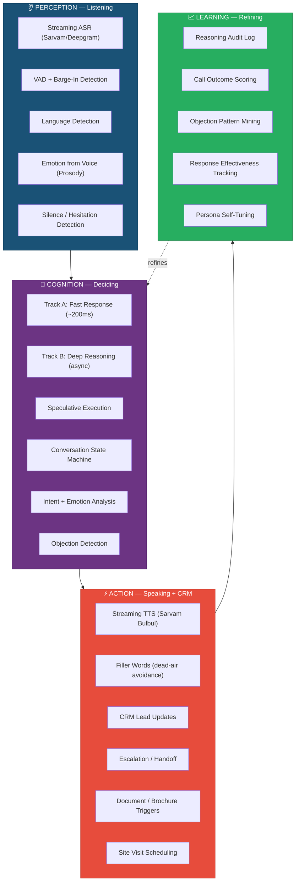
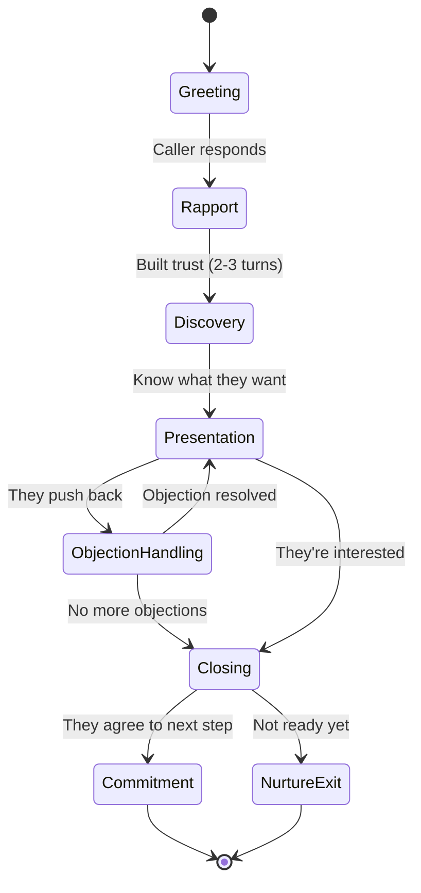
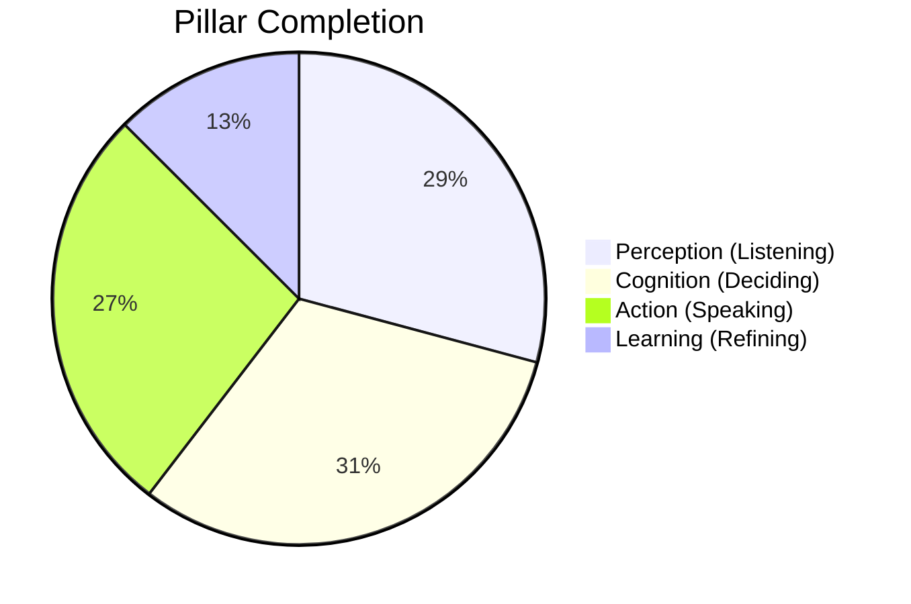

# Rohan PCAL Architecture — Human-Like Voice Intelligence

## The 4 Pillars



---

## Pillar 1: 👂 PERCEPTION (Listening to the Prospect)

> *"Understand not just what they said, but how they said it"*

### What You Already Have ✅

| Component | File | Status |
|-----------|------|--------|
| **Streaming ASR** | [ASRProvider.ts](file:///c:/Users/Sikandar%20Bharti/Desktop/ZentrixCRM/apps/digital-employee/src/voice/ASRProvider.ts) | ✅ Full streaming with Sarvam + Deepgram fallback |
| **Interim transcripts** | [ASRProvider.ts#L155-L167](file:///c:/Users/Sikandar%20Bharti/Desktop/ZentrixCRM/apps/digital-employee/src/voice/ASRProvider.ts#L155-L167) | ✅ Real-time partials for speculative LLM |
| **Barge-in detection** | [BargeInHandler.ts](file:///c:/Users/Sikandar%20Bharti/Desktop/ZentrixCRM/apps/digital-employee/src/voice/BargeInHandler.ts) | ✅ Multi-feature VAD (RMS + ZCR + adaptive noise) |
| **Language detection** | [LanguageDetector.ts](file:///c:/Users/Sikandar%20Bharti/Desktop/ZentrixCRM/apps/digital-employee/src/voice/LanguageDetector.ts) | ✅ Script-range heuristic detection |
| **Opus 16kHz codec** | [voice_bridge.ts](file:///c:/Users/Sikandar%20Bharti/Desktop/ZentrixCRM/scratch/voice_bridge.ts) | ✅ Zero-transcode path |

### What's Missing 🔲

#### 1. Prosodic Emotion Detection (Voice Tone Analysis)

Right now, Rohan detects emotion **from text only** (Track B reasoning prompt). But 55% of emotional information is in the **voice itself** — pitch, speed, volume, tremor.

```
Caller says: "Haan theek hai" (text = neutral)
But voice is: low pitch, slow pace, trailing off (prosody = disappointed/losing interest)
```

**Implementation**: Extract 3 acoustic features from each PCM frame before sending to ASR:

```typescript
// New file: apps/digital-employee/src/voice/ProsodyAnalyzer.ts

interface ProsodyFrame {
    pitch_hz: number;       // F0 fundamental frequency
    energy_db: number;      // loudness in dB
    speaking_rate: number;  // syllables/sec estimate
    emotion_signal: 'rising' | 'falling' | 'flat' | 'agitated';
}

// Feed these features into Track B reasoning as additional context:
// "Voice prosody: pitch falling, energy low, pace slowing → likely losing interest"
```

**Why it matters for sales**: A prospect who says "I'll think about it" with rising energy + fast pace is **interested but cautious**. The same words with falling energy + slow pace means **they're leaving**. Rohan needs to respond differently.

---

#### 2. Silence & Hesitation Semantics

Right now, silence = "caller stopped talking, process turn." But silence has **meaning**:

| Silence Type | Duration | Meaning | Rohan Should... |
|-------------|----------|---------|-----------------|
| **Thinking pause** | 1–3s | Considering your offer | Wait quietly, don't interrupt |
| **Hesitation** | 3–5s | Unsure, needs nudge | Gently prompt: "Koi aur sawal hai?" |
| **Disengagement** | 5–8s | Lost interest / distracted | Re-engage: "Hello? Main aapki koi aur help kar sakta hoon?" |
| **Abandonment** | 8s+ | Done | Graceful close: "Theek hai, main WhatsApp pe details bhej deta hoon" |

**Implementation**: Add a `SilenceClassifier` that runs alongside VAD — instead of treating all silence as "end of turn," classify it and feed the classification into Track A's prompt context.

---

#### 3. Upgrade VAD to Silero (ONNX)

The current [BargeInHandler.ts](file:///c:/Users/Sikandar%20Bharti/Desktop/ZentrixCRM/apps/digital-employee/src/voice/BargeInHandler.ts) uses RMS energy + ZCR heuristics. This works but has false triggers on:
- Background TV/music
- Car engine noise (common for Indian leads on-the-go)
- Multiple voices in the room

**Silero VAD** (2MB ONNX model) solves all of these with ~95% accuracy at <30ms latency. The interface stays the same (`feedAudio → isBargeIn`).

---

## Pillar 2: 🧠 COGNITION (Deciding the Next Best Thing to Say)

> *"Think like a senior sales rep who's closed 1000 deals"*

### What You Already Have ✅

| Component | File | Status |
|-----------|------|--------|
| **Two-track architecture** | [RohanAgent.ts](file:///c:/Users/Sikandar%20Bharti/Desktop/ZentrixCRM/apps/digital-employee/src/agent/RohanAgent.ts) | ✅ Track A (fast) + Track B (reasoning) |
| **Speculative execution** | [BaseVoiceAdapter.ts#L241-L266](file:///c:/Users/Sikandar%20Bharti/Desktop/ZentrixCRM/apps/digital-employee/src/voice/BaseVoiceAdapter.ts#L241-L266) | ✅ LLM starts on stable interim transcripts |
| **Persona engine** | [Persona.ts](file:///c:/Users/Sikandar%20Bharti/Desktop/ZentrixCRM/apps/digital-employee/src/employees/Rohan/Persona.ts) | ✅ DB-driven personality, tone, knowledge, escalation |
| **Language-specific personas** | [EnglishPersona.ts](file:///c:/Users/Sikandar%20Bharti/Desktop/ZentrixCRM/apps/digital-employee/src/employees/Rohan/EnglishPersona.ts), [HindiPersona.ts](file:///c:/Users/Sikandar%20Bharti/Desktop/ZentrixCRM/apps/digital-employee/src/employees/Rohan/HindiPersona.ts) | ✅ Tone shifts by language |
| **Structured reasoning** | [RohanReasoning.ts](file:///c:/Users/Sikandar%20Bharti/Desktop/ZentrixCRM/apps/digital-employee/src/cognition/reasoning/RohanReasoning.ts) | ✅ Intent, emotion, stage, objection, CRM update |
| **Escalation rules** | [Persona.ts#L188-L241](file:///c:/Users/Sikandar%20Bharti/Desktop/ZentrixCRM/apps/digital-employee/src/employees/Rohan/Persona.ts#L188-L241) | ✅ Sentiment, discount, legal, booking triggers |
| **Context / memory** | [MemoryService.ts](file:///c:/Users/Sikandar%20Bharti/Desktop/ZentrixCRM/apps/digital-employee/src/memory/MemoryService.ts) | ✅ Redis + PG + pgvector RAG |
| **Model routing** | [ModelRouter](file:///c:/Users/Sikandar%20Bharti/Desktop/ZentrixCRM/apps/digital-employee/src/ai/routing) | ✅ Route Track A vs Track B to different models |

### What's Missing 🔲

#### 1. Conversation State Machine (Turn-Level Control)

Right now, the voice adapter uses a simple flag-based turn lifecycle (`turnFinalized`, `speculativeInFlight`). This doesn't model **conversation dynamics** — the fact that a call goes through phases:



**Implementation**: Add a `CallPhaseTracker` that reads Track B's `stage` output and adjusts Track A's prompt dynamically:

- **Rapport phase**: Be warm, ask about their day, don't push project yet
- **Discovery phase**: Ask open questions ("Aapka budget kitna hai?", "Kab tak move karna chahte hain?")
- **Presentation phase**: Match project features to their needs
- **Objection handling**: Acknowledge, reframe, social proof
- **Closing phase**: Create urgency, offer next step (site visit / callback)

#### 2. Objection Playbook (Pre-Loaded Responses)

Real estate sales reps have rehearsed responses to the 20 most common objections. Rohan should too.

```typescript
// Objection library (loaded from DB per tenant)
const OBJECTION_PLAYBOOK = {
    'price_too_high': {
        acknowledge: "Samajh raha hoon, {name} ji. Budget important hai.",
        reframe: "Agar EMI ki baat karein to ₹{emi}/month aata hai — ek rent jaisa.",
        social_proof: "Pichle mahine {count} families ne same range mein booking ki.",
        close: "Kya main aapko EMI calculator share karoon?"
    },
    'not_ready': {
        acknowledge: "Koi pressure nahi hai ji.",
        create_fomo: "Bas itna batata hoon ki is phase mein sirf {units} units bachein hain.",
        offer_low_commitment: "Site visit free hai, Sunday ko family ke saath aa jayein?"
    },
    // ... 18 more
};
```

**Why**: Instead of the LLM inventing a response every time (which varies in quality), pre-approved objection handling ensures **consistent, tested sales techniques** while the LLM handles personalization.

#### 3. Hinglish-Aware Response Calibration

The current [rohan_fast.txt](file:///c:/Users/Sikandar%20Bharti/Desktop/ZentrixCRM/apps/digital-employee/src/prompts/sales/rohan_fast.txt) is a single line. It needs a richer Hinglish calibration:

```
RESPONSE RULES:
- Match the caller's code-mixing ratio. If they say "What's the price?", respond in English.
  If they say "Bhai price kya hai?", respond in Hinglish.
- Keep voice responses under 2 sentences (8-12 seconds of speech max).
- End with a question to keep the conversation going.
- Use the caller's first name naturally: "{name} ji" for respect, just "{name}" for rapport.
- Don't use English jargon with Hindi-dominant callers (say "khareedna" not "purchase").
- Avoid Sanskritized Hindi. Use street Hindi: "acha" not "uttam", "sahi" not "sarvottam".
```

---

## Pillar 3: ⚡ ACTION (Speaking + Updating CRM)

> *"Sound natural, act fast, update everything in real-time"*

### What You Already Have ✅

| Component | File | Status |
|-----------|------|--------|
| **Streaming TTS** | [TTSProvider.ts](file:///c:/Users/Sikandar%20Bharti/Desktop/ZentrixCRM/apps/digital-employee/src/voice/TTSProvider.ts) | ✅ Clause-level chunking, barge-in abort |
| **Filler words** | [FillerWordManager.ts](file:///c:/Users/Sikandar%20Bharti/Desktop/ZentrixCRM/apps/digital-employee/src/voice/FillerWordManager.ts) | ✅ Language-aware, cooldown, variety rotation |
| **CRM updates** | [CrmUpdater](file:///c:/Users/Sikandar%20Bharti/Desktop/ZentrixCRM/apps/digital-employee/src/integrations/crm) | ✅ Lead scoring, notes, automation triggers |
| **Escalation + handoff** | [Config.ts](file:///c:/Users/Sikandar%20Bharti/Desktop/ZentrixCRM/apps/digital-employee/src/employees/Rohan/Config.ts) | ✅ Natural handoff messages, context briefs |
| **Opus voice bridge** | [voice_bridge.ts](file:///c:/Users/Sikandar%20Bharti/Desktop/ZentrixCRM/scratch/voice_bridge.ts) | ✅ Zero-transcode, jitter buffer, precision timer |

### What's Missing 🔲

#### 1. Pre-Cached Opus Filler Audio

Currently, fillers go through the full TTS pipeline: text → Sarvam API → WAV → PCM → WS → Bridge → Opus → RTP. That's ~300ms just for "hmm".

**Fix**: At startup, pre-synthesize all fillers and cache them as raw PCM 16kHz buffers in memory. When a filler is needed, inject directly into the voice bridge — **zero TTS latency**.

```typescript
// In FillerWordManager constructor:
async warmCache(tts: TTSProvider, voiceId: string, params: TtsParams) {
    for (const filler of this.fillers) {
        this.audioCache.set(filler, await tts.synthesizeToBuffer(filler, voiceId, params));
    }
}

// When filler is due:
const cached = this.audioCache.get(filler);
if (cached) ws.send(cached);  // Instant playback, no API call
```

**Latency impact**: Filler delivery drops from ~300ms → **<5ms**.

#### 2. LLM Streaming → TTS Sentence Chunking Pipeline

Currently in [RohanAgent.ts#L71-L74](file:///c:/Users/Sikandar%20Bharti/Desktop/ZentrixCRM/apps/digital-employee/src/agent/RohanAgent.ts#L71-L74), `generateAIResponse` waits for the **complete** LLM response before returning. The TTS then processes the full text.

**Fix**: Stream LLM tokens and pipe to TTS at sentence boundaries:

```
LLM token stream: "Bilkul" "," " " "aapka" " " "GSTIN" " " "note" " " "kar" " " "liya" "."
                                                                                              ↑ sentence end
                   ──────────────────── sentence 1 ────────────────────────────────────────────
                   └──→ immediately send to TTS while LLM continues generating sentence 2
```

**Latency saved**: ~800-1200ms (TTS starts on first sentence while LLM generates the rest).

#### 3. Parallel CRM Writes (Non-Blocking)

Track B currently writes to CRM synchronously ([RohanAgent.ts#L126-L140](file:///c:/Users/Sikandar%20Bharti/Desktop/ZentrixCRM/apps/digital-employee/src/agent/RohanAgent.ts#L126-L140)). These writes don't affect the voice response but they share the event loop.

**Fix**: Publish CRM update events to the Event Bus (`@zentrix/events`) and let `apps/worker` handle them asynchronously — per your AGENTS.md architecture rules.

---

## Pillar 4: 📈 LEARNING (Refining Future Calls)

> *"Every call makes Rohan smarter for the next one"*

### What You Already Have ✅

| Component | File | Status |
|-----------|------|--------|
| **Reasoning audit log** | [RohanAgent.ts#L161-L173](file:///c:/Users/Sikandar%20Bharti/Desktop/ZentrixCRM/apps/digital-employee/src/agent/RohanAgent.ts#L161-L173) | ✅ Full turn-level logging with latency |
| **Conversation memory** | [MemoryService.ts](file:///c:/Users/Sikandar%20Bharti/Desktop/ZentrixCRM/apps/digital-employee/src/memory/MemoryService.ts) | ✅ Redis + PG + pgvector |
| **Emotion trend tracking** | [RohanAgent.ts#L146](file:///c:/Users/Sikandar%20Bharti/Desktop/ZentrixCRM/apps/digital-employee/src/agent/RohanAgent.ts#L146) | ✅ Last 5 emotions tracked |
| **Latency metrics** | [BaseVoiceAdapter.ts#L424-L445](file:///c:/Users/Sikandar%20Bharti/Desktop/ZentrixCRM/apps/digital-employee/src/voice/BaseVoiceAdapter.ts#L424-L445) | ✅ Per-turn ASR/LLM/TTS timing |

### What's Missing 🔲

#### 1. Call Outcome Feedback Loop

After a call ends, Rohan doesn't know if it was **successful**. Did the lead:
- Book a site visit? → Great call
- Ask for callback? → Good call
- Hang up angry? → Bad call
- Ghost after 2 turns? → Failed engagement

**Implementation**: A `CallOutcomeScorer` that runs after `ws.close`:

```typescript
// Score the call based on conversation state at disconnect
interface CallOutcome {
    outcome: 'converted' | 'warm' | 'cold' | 'lost' | 'escalated';
    engagement_score: number;        // 0-100 based on turn count, question depth
    objection_resolution_rate: number; // % of objections successfully handled
    sentiment_trajectory: 'improving' | 'stable' | 'declining';
    next_best_action: string;         // "follow_up_24h" | "send_brochure" | "assign_human"
}
```

This score feeds into the **lead's CRM record** and into Rohan's context for the **next call** with the same lead.

#### 2. Response Effectiveness Tracking

Track which Rohan responses **worked** (caller engaged, asked more, moved forward) vs **failed** (caller went silent, objected, hung up):

```
Turn 3: Rohan said "Is project mein swimming pool bhi hai"
        → Caller response: "Achha? Aur kya features hain?" (engagement ↑)
        → Score: +1 (effective)

Turn 5: Rohan said "Price thoda premium hai lekin quality best hai"
        → Caller response: "Bahut zyada hai yaar" (objection triggered)
        → Score: -1 (ineffective)
```

Over 1000 calls, you get a **statistically significant map** of which responses work for which objections, lead segments, and project types. This becomes Rohan's training data.

#### 3. Persona Self-Tuning (Adaptive Prompts)

After every N calls (e.g., 50), a background worker analyzes the accumulated call outcomes and adjusts Rohan's persona config:

```typescript
// Worker: apps/worker/src/jobs/PersonaTuner.ts
// Runs nightly, reads ai_reasoning_log + call outcomes

// If objection resolution rate for "price" objections is < 40%:
//   → Add new social proof data to knowledge base
//   → Increase emphasis on EMI/payment plan in rohan_fast.txt prompt

// If caller engagement drops after turn 4:
//   → Reduce response length
//   → Add more questions to keep dialogue going

// If Hinglish callers convert 2x better than pure Hindi:
//   → Bias default language toward Hinglish
```

#### 4. Cross-Lead Intelligence

When Rohan talks to 100 leads about the same project, he should learn **project-level insights**:

```
"85% of leads ask about parking first → Mention parking proactively"
"Leads who hear about the school nearby are 3x more likely to book a visit"
"Price objection is best handled with EMI framing (72% success) vs value framing (41% success)"
```

This intelligence is aggregated by the worker and injected into the knowledge block of [Persona.ts#L116-L168](file:///c:/Users/Sikandar%20Bharti/Desktop/ZentrixCRM/apps/digital-employee/src/employees/Rohan/Persona.ts#L116-L168).

---

## Current State vs Target State



| Pillar | Built | Missing | Impact |
|--------|-------|---------|--------|
| **Perception** | Streaming ASR, VAD, barge-in, language detect | Prosody emotion, silence semantics, Silero VAD | Medium |
| **Cognition** | Two-track, speculative exec, persona, reasoning, escalation | Call phase tracker, objection playbook, Hinglish calibration | High |
| **Action** | Streaming TTS, fillers, CRM updates, Opus bridge | Pre-cached fillers, LLM→TTS streaming, event bus CRM | High |
| **Learning** | Audit log, emotion trends, latency metrics | Call outcome scoring, response effectiveness, persona tuning | Critical |

---

## Recommended Implementation Roadmap

### Phase 1: "Sound Human" (1 week)
1. Pre-cache filler audio at startup → zero-latency fillers
2. LLM streaming + sentence chunking → TTS starts 1s earlier
3. Enrich [rohan_fast.txt](file:///c:/Users/Sikandar%20Bharti/Desktop/ZentrixCRM/apps/digital-employee/src/prompts/sales/rohan_fast.txt) with Hinglish calibration rules
4. Add silence classification (thinking / hesitation / disengagement)

### Phase 2: "Think Like a Sales Rep" (1 week)
5. Call phase state machine (Greeting → Discovery → Presentation → Close)
6. Objection playbook loaded from DB
7. Phase-aware prompt injection into Track A

### Phase 3: "Learn From Every Call" (1 week)
8. Call outcome scorer (runs on `ws.close`)
9. Response effectiveness tracker (per-turn scoring)
10. Nightly persona tuner worker job

### Phase 4: "Superhuman Intelligence" (ongoing)
11. Prosody emotion detection from voice
12. Cross-lead project intelligence
13. Silero VAD upgrade
14. A/B testing framework for response strategies

> [!TIP]
> **Phase 1 gives 80% of the perceived improvement.** The difference between "talking to a bot" and "talking to a human" is mostly about **timing** (fillers, streaming) and **language calibration** (Hinglish rules), not about smarter reasoning.

Which phase should we start implementing?
